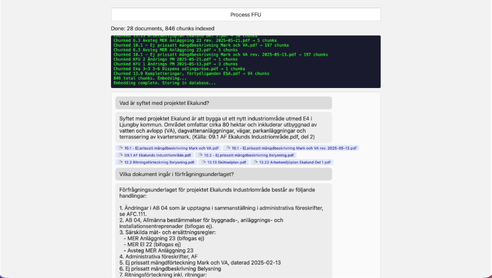
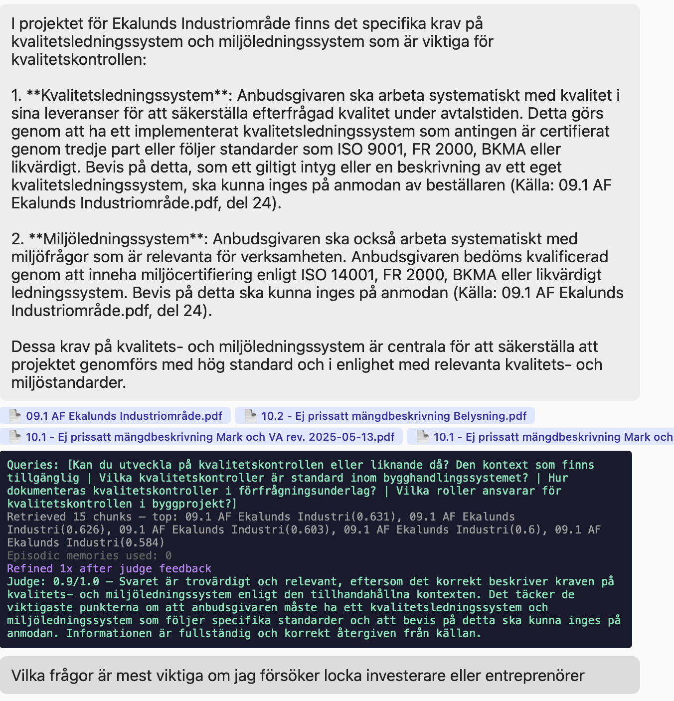

# FFU Analyzer

A RAG application for querying Swedish tender documents (förfrågningsunderlag). Process PDF construction documents, then ask questions in natural language and get answers grounded in the source material.

My chosen track for this assignment was Backend/AI/Infra, and therefore chose to implement better retrieval methods and querying.

Key additions are:
- **Chunking** — Documents split into 500-token chunks with 100-token overlap
- **Embedding** — Chunks are embedded via OpenAI in concurrent batches with threads
- **Multi-query generation** — A big problem with RAG is scalability, large datasets drastically decrease performance in regards to both time and precision. Multiple sub-queries improve recall across different document sections.
- **Episodic memory (COALA)** — Past Q&A interactions are embedded and stored. On new queries, relevant previous answers are recalled and included as additional context, allowing the system to build on its own conversation history.
- **LLM-as-a-judge** - Implemented judge to evaluate answers and provide feedback.
- **Refinement Loop** - Implemented a refinement loop where the system can refine its answers based on feedback from the judge.
- **Streaming** - Implemented streaming of events to the chat UI for a more responsive feel. Judge feedback included to guide user in improving their questions if answers are lackluster. 


## Live demo

**https://ffu-analyzer-851230900226.europe-north1.run.app**

1. Click **Process FFU** — wait for extraction, chunking, and embedding to complete (progress shown in the log panel)
2. Ask questions in the chat input

> **Note:** The database is ephemeral. If the container has restarted since the last use, one person needs to click Process FFU before chatting. Subsequent users can chat immediately, pressing Process FFU again will affect all other users as well. 




## How it works

1. **Process FFU** is clicked — the backend extracts all PDFs to markdown using `pymupdf4llm` (4 parallel workers)
2. Each document is split into overlapping chunks (~500 tokens each, 100-token overlap) to preserve context across chunk boundaries
3. All chunks are embedded via OpenAI in concurrent batches and stored alongside their vectors in SQLite
4. When a user asks a question, `gpt-4o-mini` generates 3 alternative search queries to cover different angles of the question
5. Each query is embedded and compared against all stored chunks using cosine similarity. Results are deduplicated and the top 15 are selected
6. The system also searches **episodic memory** — past Q&A interactions are embedded and compared to the new question. Relevant previous answers are included as additional context (COALA framework)
7. `gpt-4o` synthesizes an answer from the retrieved chunks + relevant past interactions, citing source documents
8. An **LLM-as-a-judge** (`gpt-4o`) evaluates the answer for faithfulness, relevance, and completeness, returning a score and reasoning
9. If the judge scores below 0.8, the system enters a **refinement loop**.
10. Each pipeline step is **streamed** to the UI as server-sent events, so the user sees live progress (searching, generating, evaluating, refining)

## Project structure

```
ffu-analyzer-retrieval/
├── backend/
│   ├── main.py                 # FastAPI app, SSE streaming endpoints
│   ├── utils/
│   │   ├── database.py         # SQLite schema and helpers
│   │   ├── chunking.py         # Paragraph chunking with overlap
│   │   ├── embeddings.py       # Batch embedding and cosine similarity search
│   │   └── llm.py              # Sub-query generation and answer synthesis
│   ├── eval/
│   │   └── judge.py            # LLM-as-a-judge evaluation
│   └── memory/
│       └── episodic.py         # COALA episodic memory (store/recall Q&A)
├── frontend/
│   ├── src/main.tsx            
│   └── vite.config.js          
├── Dockerfile                  
├── .env.example                        
└── README.md
```

## Tech stack

- **Backend:** Python, FastAPI, SQLite, OpenAI API
- **Frontend:** React, Vite, TypeScript
- **Deployment:** Docker, GCP Cloud Run

## What I would do with more time

- **Vector database** — replace SQLite with pgvector or Pinecone for persistent, scalable storage across sessions and users.
- **Procedural memory (COALA)** — build a knowledge base from judge feedback, storing what the model learns to avoid and what worked in the past. With an ephemeral database this wasn't practical, but would be valuable with persistent storage. The episodic memory could also be extended with dynamic behavioural guidelines.
- **Streaming answers** — stream the LLM response token-by-token for better perceived performance, so the user doesn't have to wait for the entire answer block.
- **File upload** — let users upload their own PDFs through the UI.
- **Multimodal support** — use a vision model to extract information from drawings, diagrams, and tables, which are currently ignored during extraction.
